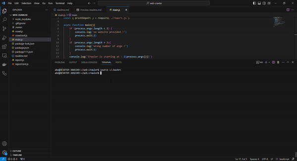

# Web Crawler Project

Web Crawler in JavaScript using `Node.js`! This application generates an "internal links" report for any website on the internet by crawling each page of the site.

## Preview




## Getting Started

### Prerequisites : 

Make sure you have the following installed on your machine:

- `node` : The JavaScript runtime. This will let us run the JavaScript files.
- `npm` : The package manager. This manages dependencies, metadata, and allows to specify "scripts" to run.

The `package.json` file is created during npm init, and will contain the script run that runs `main.js` using node. 

### Installation

1. Clone the repository:

    ```bash
    git clone https://github.com/Abe-alt/web-crawler.git

2. Navigate to the project directory:

    ```bash
    cd web-crawler


### Running the Crawler

To start the web crawler, run the following command:   
    `npm run start website_to_crawl`

### Features

These are the main functions used in the programm : 
- `normalizeURL()` compare URLs to see if they are the same page.
- `getURLsFromHTML()`:  takes a string of HTML as input and returns a list of all the link URLs using a third-party HTML parsing library `JSDOM`
- `crawlPage()` : fetch the webpage of the `currentURL` in a recursive way until we've crawled every page on the site
- `printReport(pages)` : convert the pages object into a report and log it to the console.
- `main()` : fix the number of CLI arguments at 1, which is the `base_url`
 
